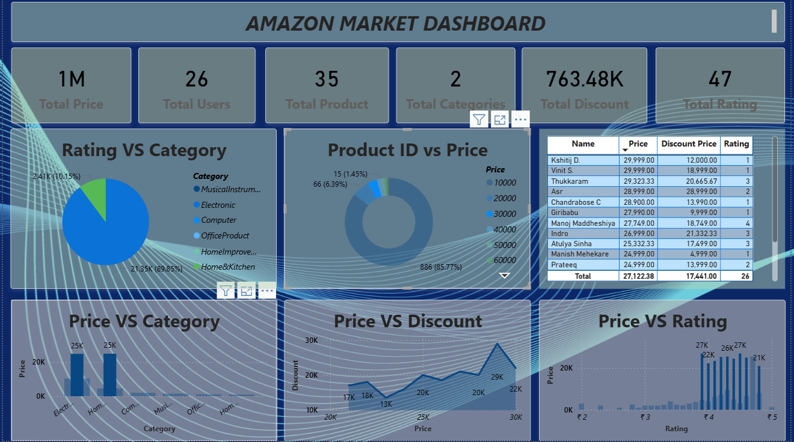
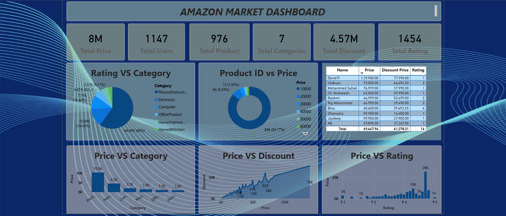

# 📊 Amazon Market Dashboard

A visually rich, data-driven dashboard that analyzes product performance, user engagement, and pricing strategies on a simulated Amazon marketplace. Built for business intelligence, this dashboard helps stakeholders make informed decisions using interactive charts, metrics, and tables.

## 🚀 Features

- **Top-Level Metrics**: Real-time summary of total price, users, products, categories, discounts, and ratings.
- **Category Insights**:
  - *Rating vs Category* (Pie/Bar Chart): Understand how different product categories perform in terms of user ratings.
  - *Price vs Category* (Bar Chart): Compare pricing trends across categories.
- **Product-Level Analysis**:
  - *Product ID vs Price* (Pie Chart): Visual breakdown of pricing by product ID.
  - *Price vs Discount* (Line Chart): Correlation between product price and discount offered.
  - *Price vs Rating* (Scatter Plot): Relationship between pricing and user ratings.
- **Data Table**: Tabular view of product details including name, price, discount price, and rating.

## 🛠️ Tech Stack

- **Frontend**: Power BI / Tableau / Custom JS (depending on implementation)
- **Backend**: CSV / SQL / MongoDB (data source)
- **Design**: Minimalist, cinematic layout with intuitive UX

## 📊 Dashboard Preview





## 📂 Folder Structure

📁 Amazon-Market-Dashboard/ 

├── assets/ # Images, icons, and visual assets 

├── data/ # Raw and cleaned datasets 

├── dashboard.pbix # Power BI dashboard file (if applicable) 

├── README.md # Project overview


## 📈 Use Cases

- 📦 **E-commerce Analytics**: Track product performance and user behavior
- 🧠 **Business Intelligence**: Identify pricing strategies and category trends
- 🎯 **Recruiter Showcase**: Demonstrates data visualization and dashboarding skills

## 🧪 Sample Data Highlights

- **Total Price**: ₹8M+
- **Total Users**: 1,147
- **Total Products**: 976
- **Top Categories**: Electronics, Books, Furniture
- **Rating Distribution**: Electronics leads with 24.13% of total ratings

## 🧰 How to Run

1. Clone the repo:
   ```bash
   git clone https://github.com/your-username/amazon-market-dashboard.git

2.Open the dashboard file (.pbix or .twbx) in Power BI or Tableau.

3.Connect to the data source if prompted.

4.Explore the interactive visualizations!

##🙋‍♂️ Author

Harshit Full Stack Developer | UI/UX Animator | Data Viz Enthusiast 

📬 LinkedIn : https://www.linkedin.com/in/harshit-7217-chaudhary/

🐦 Twitter : https://x.com/cha84587


Want help turning this into a portfolio case study or adding recruiter-facing bullet points? I can help you write that too 💼✨
